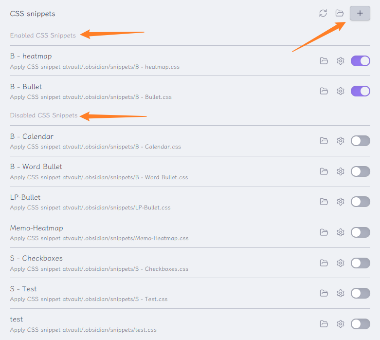

# Obsidian Better Default Setting

You can use this plugin to create CSS snippets, or make enabled plugin invisible for Obsidian. And also manage your snippets easily.

## 使用说明 | Usage

1. **Open The Plugin**:
	- Then, you can add new snippet by pressing `+` button;
    - You can also edit the snippet by clicking the snippet;

---

## Support

If you are enjoying this plugin then please support my work and enthusiasm by buying me a coffee
on [https://www.buymeacoffee.com/boninall](https://www.buymeacoffee.com/boninall).

